# 第一章 VirtualBox的配置与使用

## 实验目的

- 熟悉基于 OpenWrt 的无线接入点（AP）配置
- 为第二章、第三章和第四章实验准备好「无线软 AP」环境

---

## 实验环境

- 可以开启监听模式、AP 模式和数据帧注入功能的 USB 无线网卡
- Virtualbox

---

## 实验要求

- [✔] 对照第一章实验 `无线路由器/无线接入点（AP）配置` 列的功能清单，找到在 `OpenWrt` 中的配置界面并截图证明
- [✔] 记录环境搭建步骤
- [✔] 如果 USB 无线网卡能在 `OpenWrt` 中正常工作，则截图证明

---

## 实验过程

### OpenWrt on VirtualBox环境搭建

-   
    下载资源
    ```
    # 下载镜像文件
    wget https://downloads.openwrt.org/releases/19.07.5/targets/x86/64/openwrt-x86-64-combined-squashfs.img.gz
    # 解压缩
    gunzip openwrt-x86-64-combined-squashfs.img.gz
    ```
    
-   
    在GIT BASH中修改img文件大小
    ```
    dd if=openwrt-x86-64-combined-squashfs.img of=openwrt-x86-64-combined-squashfs-padded.img bs=128000 conv=sync
    ```
    

-   
    在GIT BASH中转换为VDI
    ```
    VBoxManage convertfromraw --format VDI openwrt-x86-64-combined-squashfs-padded.img openwrt-x86-64-combined-squashfs.vdi
    ```
    

-   
    在VIRTUALBOX中安装VDI，并设置双网卡（HOST ONLY与NAT网络）
    
    TIPS:先配置双网卡，再配置虚拟机内网络设置，否则网卡无法正常识别
    
    

-   
    在VIRTUALBOX中设置VDI多重加载，并设置VDI大小
    
    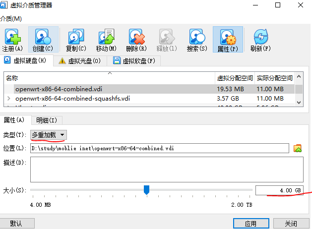

-   
    在OPENVRT虚拟机中设置网络，并重启加载指定网卡
    ```
    config interface 'lan'
    option type 'bridge'
    option ifname 'eth0'
    option proto 'static'
    option ipaddr '192.168.56.11' 
    option netmask '255.255.255.0'
    option ip6assign '60'
    ```
    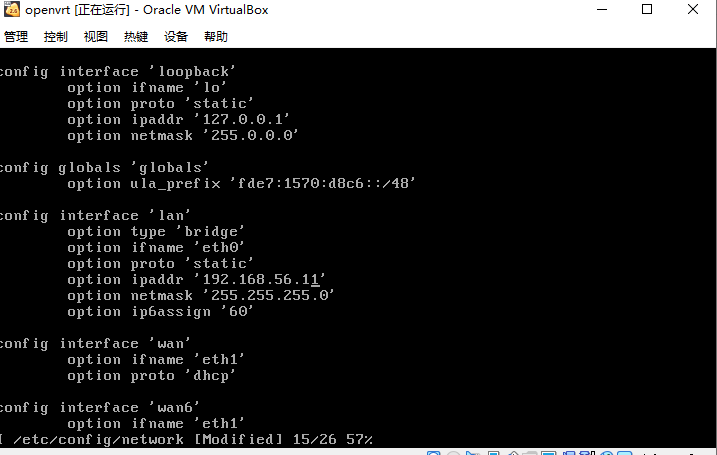
    ```
    # 网卡重新加载使配置生效
    ifdown eth0 && ifup eth0
    # 查看网卡
    ip a
    ```
    

-   
    SSH连接OPENVRT虚拟机，通过 OpenWrt 的软件包管理器 opkg 进行联网安装软件
    ```
    ssh root@192.168.56.11
    ```
    
    ```
    # 更新 opkg 本地缓存
    opkg update

    # 检索指定软件包
    opkg find luci
    # luci - git-21.079.58580-41ab871-1 - Standard OpenWrt set including full admin with ppp support and the default Bootstrap theme

    # 查看 luci 依赖的软件包有哪些 
    opkg depends luci
    # luci depends on:
    #     libc
    #     uhttpd
    #     uhttpd-mod-ubus
    #     luci-mod-admin-full
    #     luci-theme-bootstrap
    #     luci-app-firewall
    #     luci-proto-ppp
    #     libiwinfo-lua
    #     luci-proto-ipv6

    # 查看系统中已安装软件包
    opkg list-installed

    # 安装 luci
    opkg install luci

    # 查看 luci-mod-admin-full 在系统上释放的文件有哪些
    opkg files luci-mod-admin-full
    ```
    

-   
    安装好 luci 后通过浏览器访问管理 OpenWrt 的截图。首次登录不需要密码，直接可登录。
    

### 开启AP功能

-   
    OpenWrt 安装到 VirtualBox 之后，由于 VirtualBox 本身无法提供无线网卡的虚拟化仿真功能。所以如果需要在虚拟机中的 OpenWrt 开启无线网络支持，需要借助无线网卡硬件设备。

    设置USB
    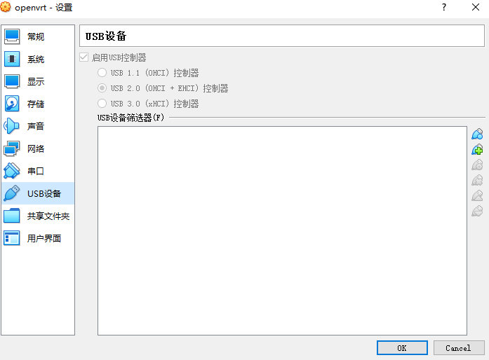

    状态栏中指定USB设备状态为已选中（√）
    

    当前待接入 USB 无线网卡的芯片信息可以通过在 虚拟机中使用 lsusb 命令的方式查看，但默认情况下 OpenWrt 并没有安装对应的软件包，需要通过opkg 命令完成软件安装。
    ```
    #每次重启 OpenWRT 之后，需要执行一次 opkg update
    opkg update && opkg install usbutils
    ```

    查看USB外设状态，确定安装成功
    ```
    # 查看 USB 外设的标识信息
    lsusb
    # Bus 001 Device 002: ID 148f:3070 Ralink Technology, Corp. RT2870/RT3070 Wireless Adapter
    # Bus 001 Device 001: ID 1d6b:0002 Linux Foundation 2.0 root hub
    # Bus 002 Device 002: ID 80ee:0021 VirtualBox USB Tablet
    # Bus 002 Device 001: ID 1d6b:0001 Linux Foundation 1.1 root hub

    # 查看 USB 外设的驱动加载情况
    lsusb -t
    # /:  Bus 02.Port 1: Dev 1, Class=root_hub, Driver=ohci-pci/12p, 12M
    |__ Port 1: Dev 2, If 0, Class=Human Interface Device, Driver=usbhid, 12M
    # /:  Bus 01.Port 1: Dev 1, Class=root_hub, Driver=ehci-pci/12p, 480M
    |__ Port 1: Dev 2, If 0, Class=Vendor Specific Class, Driver=, 480M
    ```
    

    可以看出，编号2870对应网卡缺少驱动，我们可以为他下载相应的驱动
    ```
    # 若驱动未加载，则下载驱动
    # opkg find 命令可以快速查找可能包含指定芯片名称的驱动程序包
    opkg find kmod-* | grep 2870
    # 下载对应驱动
    opkg install kmod-rt2800-usb
    ```
    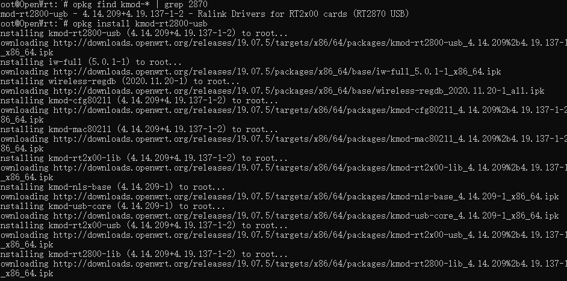

    驱动安装成功
    

    输出USB显卡性能参数
    ```
    iw list
    ```
    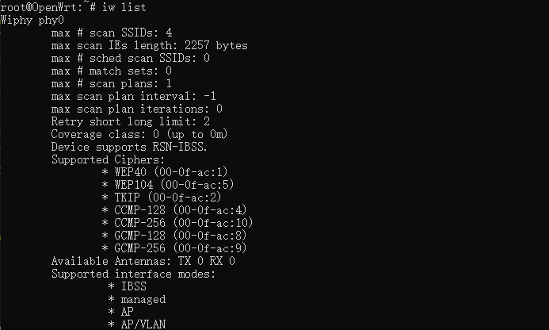


-   
    默认情况下，OpenWrt 只支持 WEP 系列过时的无线安全机制。为了让 OpenWrt 支持 WPA 系列更安全的无线安全机制，还需要额外安装 2 个软件包：wpa-supplicant 和 hostapd 。其中 wpa-supplicant 提供 WPA 客户端认证，hostapd 提供 AP 或 ad-hoc 模式的 WPA 认证。
    ```
    opkg install hostapd wpa-supplicant
    ```
    

    重启系统使配置生效，打开OPENWRT网页客户端的WIRELESS界面，设置无线网络

    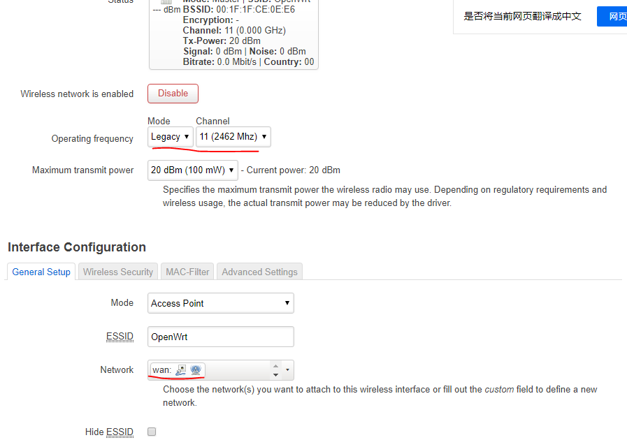

    完成无线网络配置之后，点击 Enable 按钮启用当前无线网络。可以看到当前没有设备连接

    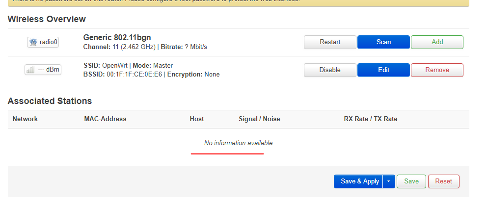

    使用无线网卡的扫描功能，可以扫描附近的无线网络并加入

    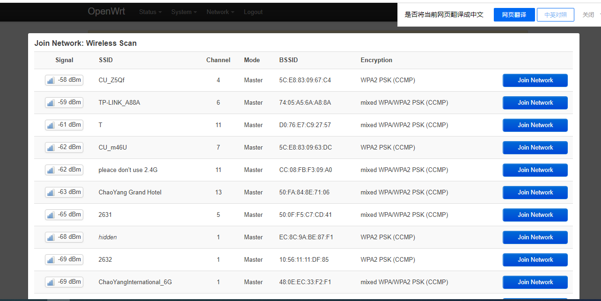

### 配置AP功能

-   重置和恢复AP到出厂默认设置状态

    

-   设置AP的管理员用户名和密码

    

-   设置SSID广播和非广播模式，并查看AP/无线路由器支持哪些工作模式

    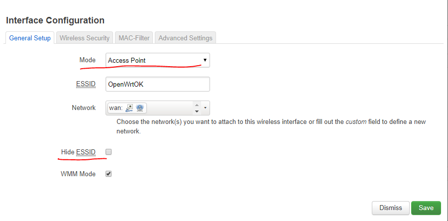
下拉MODE可以看到有无线访问点，802.11S,WDS接入点等模式；
点击HIDE ESSID即可切换非广播模式

-   配置不同的加密方式，配置AP隔离(WLAN划分)功能，设置MAC地址过滤规则（ACL地址过滤器）

    

    下拉菜单中，加密方式有WPA(2)-PSK,WPA-EAP,WEP-Shared-Keys等

    

    下拉菜单可设置MAC过滤规则

    

    设置WLAN划分

-   配置无线路由器使用自定义的DNS解析服务器，配置DHCP和禁用DHCP，开启路由器，AP的日志记录功能（对指定事件记录）

    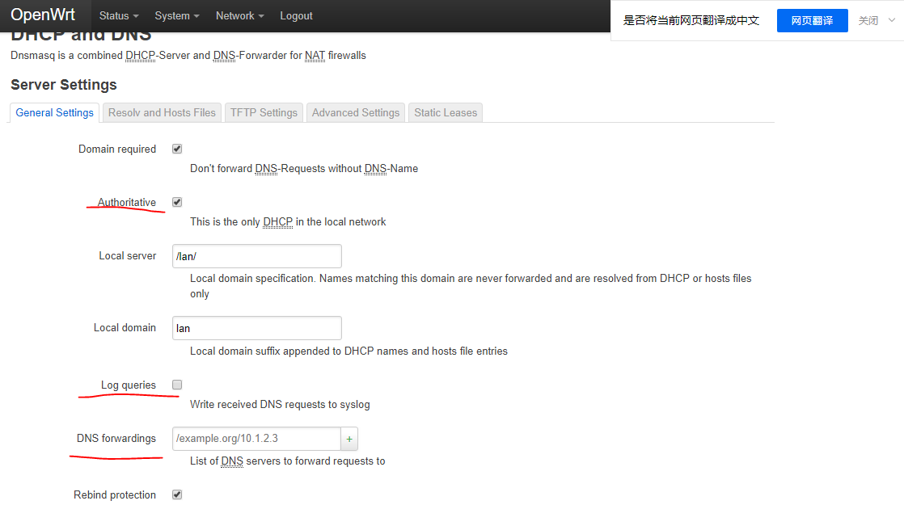

    在Network-DNS and DHCP页面内，可以实现上述功能

-   设置AP的管理员用户名和密码

    
-   设置AP的管理员用户名和密码

    

-   设置AP的管理员用户名和密码

    


### 实验测试部分AP功能


-   使用路由器/AP的配置导出备份功能，尝试解码导出的配置文件

    

    点击BACKUP下面的按钮可导出备份，也可通过下面的UPLOAD按钮上传已有的备份文件

    导出的备份文件在文件夹内。

    解码后可以看到当前的AP配置，UPLOAD上传可还原当前配置


-   使用手机连接不同配置状态下的AP对比实验

    正常模式下，设置密码后，手机正常连接

    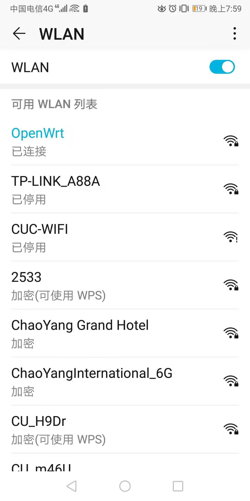

    OPEN-WRT网页上可以看到连接的信息

    

    HIDE SSID模式下，手机无法搜索到无线信号，需输入名称连接

    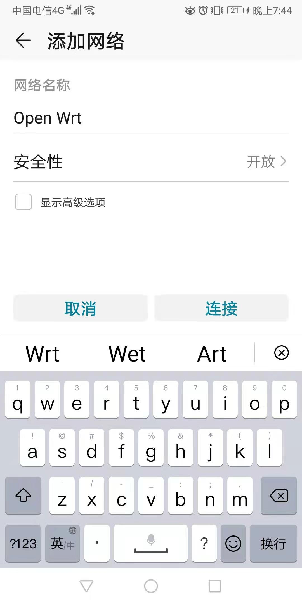

    

## 实验中遇到的问题及解决方法

- 一些问题可以通过重启解决，在此不再赘述

- VIRTUALBOX的部分命令无法执行，一种解决办法是在安装的目录下执行命令，还有一种是将安装目录加入环境变量。我使用了第二种解决办法。
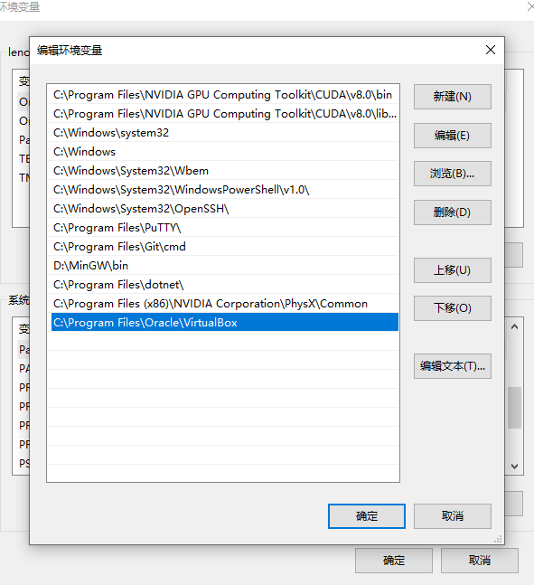
- VIRTUALBOX的命令执行失败。查阅资料使用DD命令修改ING文件大小解决


## 实验参考文献

- [黄老师第一章实验教材](https://c4pr1c3.github.io/cuc-mis/chap0x01/exp.html)


