# 第五章实验 Android模拟器环境搭建

## 实验内容

- [x] 安装和配置 Java SDK

- [x] 安装Android Studio

- [x] 下载安装 Android SDK

- [x] 配置 Android 模拟器运行环境

- [x] 配置 Gradle 编译环境

## 实验环境

- windows10
- Android Studio 4.1

### 安装Android Studio

- 由于教材提供的下载地址无法访问，在谷歌中国下载[Android Studio](https://developer.android.google.cn/studio)

- 成功安装 Android Studio

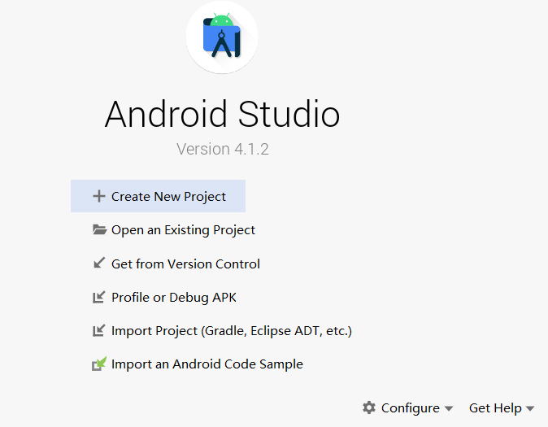

### 安装和配置 Java SDK
- Android Studio 安装后已经内置了 Java 运行时环境，通过菜单 File -> Project Structure -> SDK Location 可以查看到 Android Studio 在编译当前项目时使用的 JDK 目录。

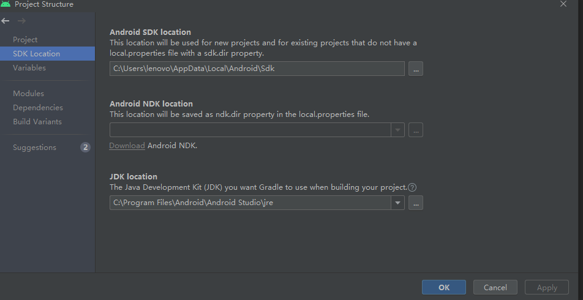

- 安装完成后环境变量未自动配置，配置环境变量后java命令可调用

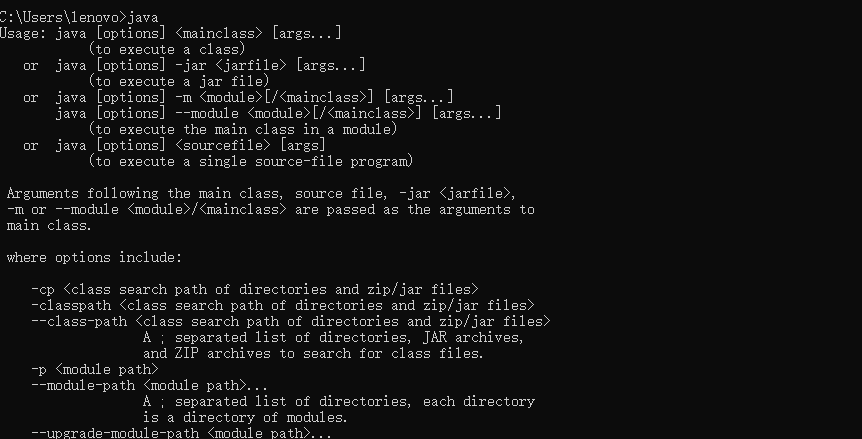

### 安装和配置 Android SDK

- 在启动 Android Studio 之后,通过启动界面的菜单选项 Configure -> SDK Manager 启动 SDK Manager ,在SDK Platforms 选项卡可以看到已经默认安装了 Android 11.0。

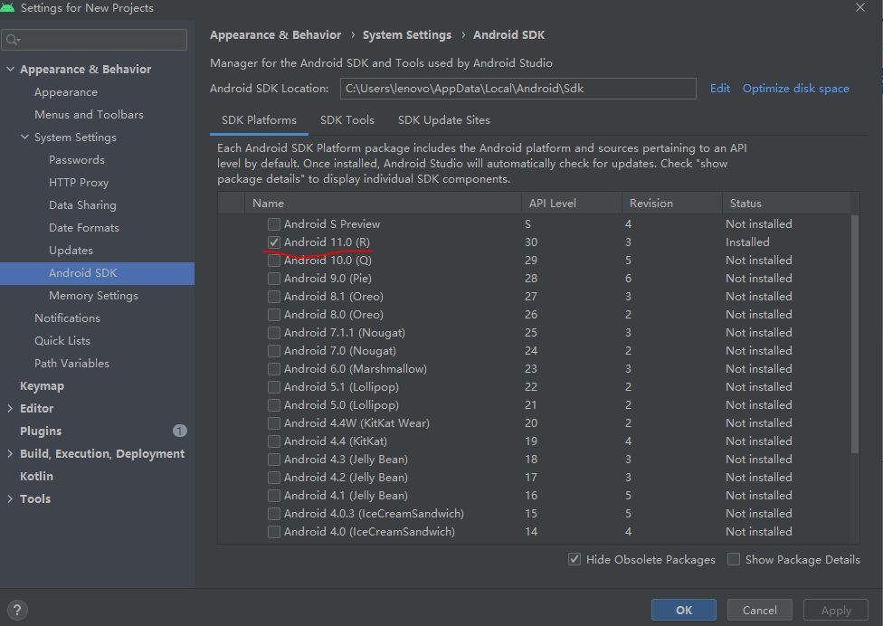

- 在 PC / Mac 上运行 Android 模拟器强烈建议必须安装 Intel x86 Emulator Accelerator (HAXM installer)，并且配合使用 ABI 类型为 x86/x86_64 的模拟器以获得最流畅的模拟器使用体验。SDK Tools选项卡中确认已安装

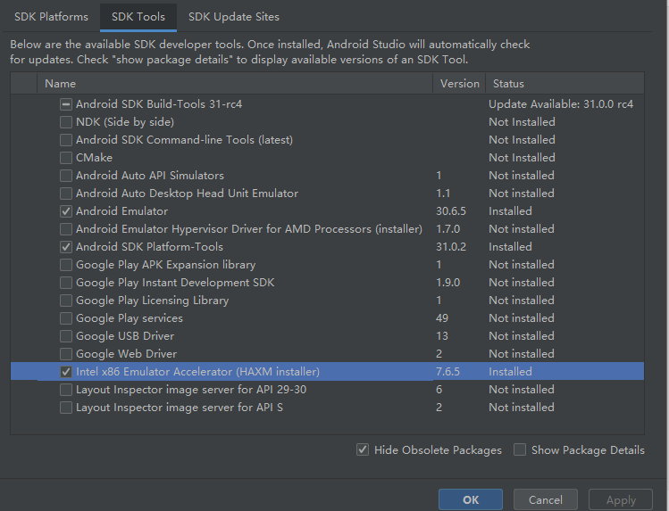

- 通过菜单 File -> Project Structure -> Project 可以查看到 Gradle 版本 和 Android Studio Gradle 插件版本

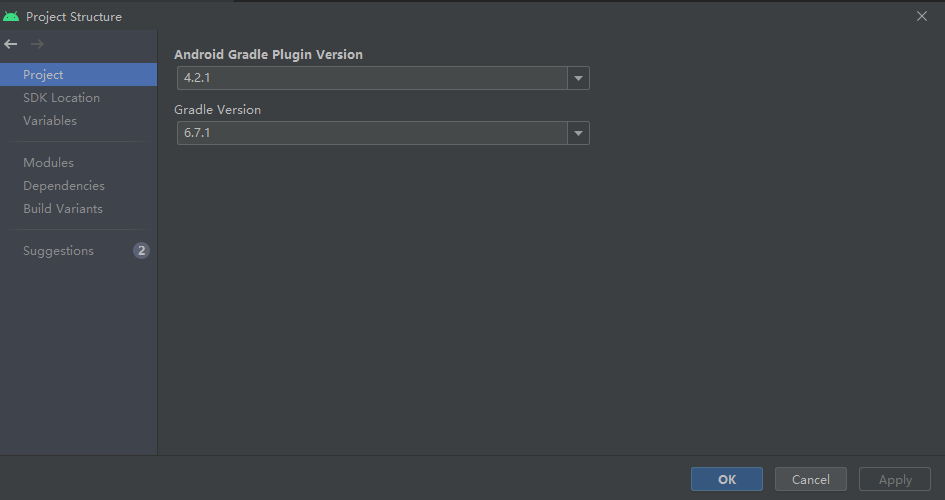

### 配置 Gradle 编译环境

- 在terminal里面输入gradlew -v, 由输出信息可知，环境已经配置Gradle 6.5。

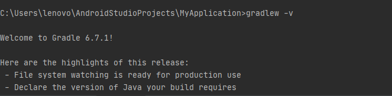

#### 遇到的问题

- Android Studio安装完成后JAVA的环境变量未设置成功

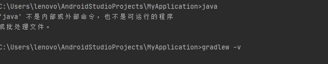

导致gradlew也无法正常使用

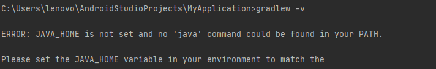

解决方法：

添加系统变量java指向jre目录下java.exe

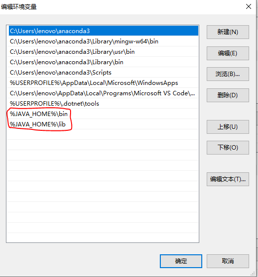

添加环境变量JAVA_HOME

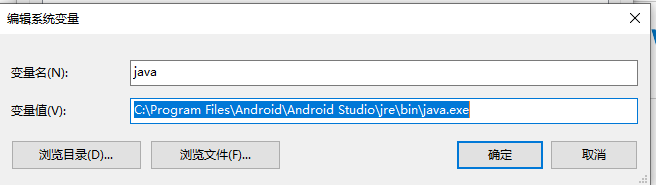

#### 参考资料

[课本](https://c4pr1c3.github.io/cuc-mis/chap0x05/exp.html)