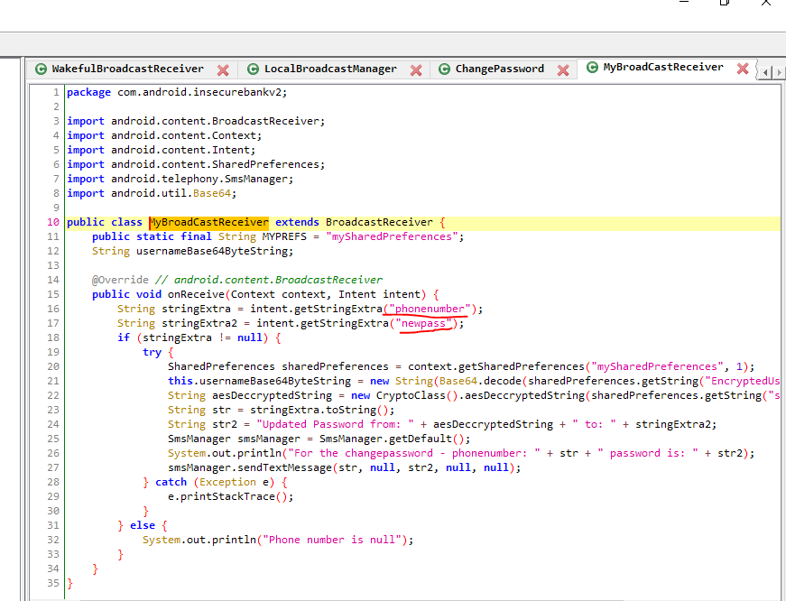

# 重新编译Android 缺陷应用漏洞攻击实验

## 实验目的

+ 理解 Android 经典的组件安全和数据安全相关代码缺陷原理和漏洞利用方法；
+ 掌握 Android 模拟器运行环境搭建和 `ADB` 使用；

## 实验环境

+ Windows 10

+ python 2.7.18

+ Android Studio 4.2.1

+ apktool 5.2.1

+ [Android-InsecureBankv2](https://github.com/c4pr1c3/Android-InsecureBankv2)

## 实验要求

- [x] 详细记录实验环境搭建过程；
- [x] 至少完成以下实验：
  - [x] Developer Backdoor
  - [x] Insecure Logging
  - [x] Android Application patching + Weak Auth
  - [x] Exploiting Android Broadcast Receivers
  - [x] Exploiting Android Content Provider

- [ ] （可选）使用不同于Walkthroughs中提供的工具或方法达到相同的漏洞利用攻击效果；
  - 推荐 [drozer](https://github.com/mwrlabs/drozer)

## 实验环境搭建

### 下载仓库到本地

```bash
git clone https://github.com/c4pr1c3/Android-InsecureBankv2.git
```

### 启动服务器

```bash
// 下载python2.7
conda create -n androidLabServerPython2 python=2.7
```


```bash
// 使用pip或者conda下载requirements.txt中相关的包 
pip install -r requirements.txt
```


```bash
// 切换到服务器相关代码的目录
cd AndroLabServer

// 运行app.py 启动后端服务器
python app.py
```


### 前后端连接

安装 InsecureBankv2.apk 到 AVD
```bash
adb install InsecureBankv2.apk
```

使用下述账户密码登录：

```
账号：jack
密码：Jack@123$
账号：dinesh
密码：Dinesh@123$
```


## 实验过程

### Developer Backdoor

#### 环境配置

1. 下载[Android-InsecureBankv2](https://github.com/c4pr1c3/Android-InsecureBankv2)：

    实验环境搭建过程中已下载

2. 下载安装[`jadx`](https://github.com/skylot/jadx)：

    ```bash
    git clone https://github.com/skylot/jadx.git
    cd jadx
    gradlew.bat dist
    ```

3. 下载[dex2jar](https://bitbucket.org/pxb1988/dex2jar/downloads///https://gitlab.com/kalilinux/packages/dex2jar/):

   

#### 实验过程

1. 解压`InsecureBankv2.apk`;

   

2. 将` classes.dex `拷贝到`dex2jar`目录下 ,执行命令转为.jar文件；

   ```bash
   d2j-dex2jar.bat classes.dex
   ```

   

3. 使用`jadx GUI`打开生成的jar文件,在`DoLgin`中我们发现，用户名`devadmin`有与其他用户名不一样的运行逻辑。

   ```bash
    ./jadx-gui dex2jar/classes-dex2jar.jar
   ```

   

   实验发现可以使用这个用户名可以用任意密码登陆到`app`中。因此，如果开发者在开发应用的时候留了后门，入侵者知道了后门，非常容易绕过验证破解成功。

   
   
   

### Insecure Logging

#### 环境配置

     `Android Studio`下载及AVD配置，已在第五章实验中完成

#### 实验过程

1. 在`Android Studio`目录下向模拟器安装`InsecureBankv2.apk`；
    
    环境配置中已完成

2. 打开模拟器上的`APP`:`InsecureBankv2`；

3. 使用logcat查看日志

    ```bash
    adb logcat -> logcat.txt
    ```

4. 成功登录Dinesh账户，并查看日志

   ​

5. 修改Dinesh账户密码

   ​

6. 查看日志可以看到用户修改后的密码及修改时间。因此，如果将用户的输入明文记录在日志中，那么入侵者窃取到用户日志，即可获得登录过的账户和修改前后的密码。

   ​


### Android Application patching + Weak Auth

#### 环境配置

1. 安装`apktool`

   ​

2. 安装`sign`文件

    ```bah
   git clone https://github.com/appium-boneyard/sign.git
    ```

#### 实验过程

1. 解压`InsecureBankv2.apk`,反汇编：

    ```bah
   apktool d InsecureBankv2.apk -o InsecureBankv2-smali
    ```

    

2. 打开`InsecureBankv2/res/values/strings.xml `,将`is_admin`的值改成`yes`；

   

3. 重新编译`InsecureBankv2`文件

    ```bah
   apktool b InsecureBankv2-smali
    ```

    
   

4. 使用`SignApk`对新生成`apk`文件进行签名,并安装（安装前需卸载原APP）

   ```bash
   C:\Users\lenvo\AppData\Local\Android\Sdk\build-tools\30.0.2\apksigner sign --min-sdk-version 19 --ks D:\keystore0622.jks --out InsecureBankv2-signed.apk InsecureBankv2.apk
   ```

    
   
6. 查看模拟器，发现有一个新的按钮`Create User`，可以用这个按钮创建一个新的用户。apk文件可以使用apktool等工具进行反编译，通过修改反编译出来的代码，再重新签名，绕过脆弱认证，从而获取admin权限。

   

### Exploiting Android Broadcast Receivers

#### 环境配置

`jadx`、`dex2jar`、`APKtool`

   已安装配置完成

#### 实验过程

1. 模拟器安装`InsecureBankv2.apk`:
    
    ```bash
    adb install InsecureBankv2.apk
    ```

    运行模拟器；使用`dinesh`登录。解压`InsecureBankv2.apk`。

    ```bash
    apktool d InsecureBankv2.apk
    ```

2. `AndroidManifest.xml` 文件中的`Broadcast receiver `定义如下：

   

3. 使用`unzip`解压`apk`文件，得到`classes.dex`,再使用`dex2jar`解压`classes.dex`文件，得到`classes-dex2jar.jar `。用`jadx-gui`打开该文件。下图是打开的`jadx`中传递到`Broadcast Receiver`中的参数：

   

   

4. 使用`adb sehll`进入`shell`目录,使用命令绕过登录直接修改密码。

    ```bash
    am broadcast -a theBroadcast -n com.android.insecurebankv2/com.android.insecurebankv2.MyBroadCastReceiver --es phonenumber 5554 --es newpass Dinesh@123!
    ```

    

如下图可见，执行这条命令时，向5554发送了一条信息。（对应上文中`sendTextMessage`函数）


成功修改当前用户Jack的密码。可以看出，不仅可以使用工具绕过登录直接修改用户密钥，如果获取短信记录也会泄露密码相关的信息，为攻击者提供帮助


### Exploiting Android Content Provider

#### 环境配置

+ 上述实验中已完成相关环境配置

#### 实验过程

1. 同上述几个实验部分：`adb  install` apk文件、使用`dinesh\Dinesh@123$`登陆、`apktool d  InsecureBankv2.apk`反编译、`unzip InsecureBankv2.apk`解压apk文件、`sh d2j-dex2jar.sh classes.dex`使用将`dex2jar`转换成`classes-dex2jar.jar`、使用`jadx-gui`打开转换生成的`jar`文件。

2. 打开`unzip`得到的`AndroidManifest.xml `:可知`com.android.insecurebankv2.TrackUserContentProvider"`包名。

   

3. 查看使用`jadx-gui`打开的反编译文件中给上述页面传递的参数：

   

4. adb命令行中执行命令获取登录顺序与登录用户名：

    ```shell
    content query --uri content://com.android.insecurebankv2.TrackUserContentProvider/trackerusers
    ```

id对应登录的次序，name是登录用户用户名。输出结果随着用户的登录情况更新。这个程序以明文的方式保存登录记录，如果得到设备上的登录记录，就能得到用户的用户名，结合前面步骤获取的密码，实现绕过登录。


## 实验问题


+ adb install应用程序失败

  + 原因：原应用程序未卸载

  + 解决方法：卸载原程序后重新安装


## 参考文献

+ [Android-InsecureBankv2](https://github.com/c4pr1c3/Android-InsecureBankv2/tree/master/Walkthroughs)

+ [课本 · 第八章实验 · 移动互联网安全](https://c4pr1c3.github.io/cuc-mis/chap0x08/exp.html)